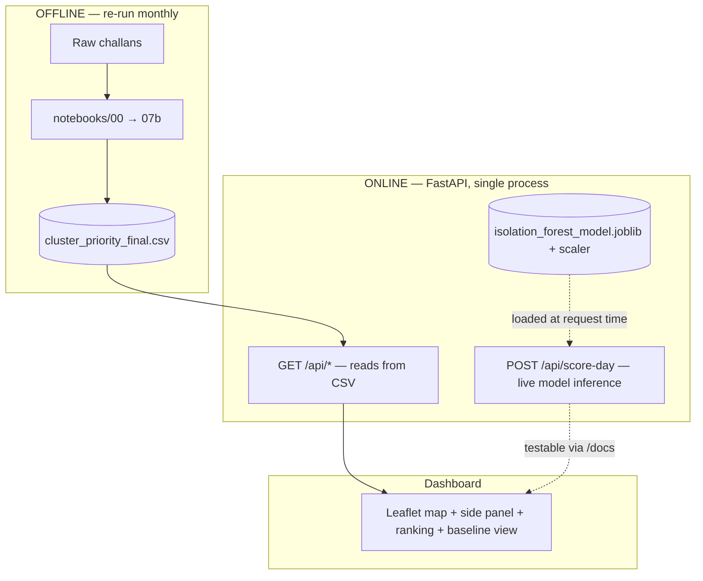
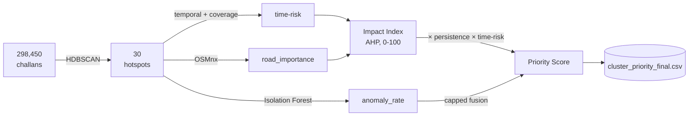

# Architecture

Technical deep-dive — read this when the question is "okay, but why did
you design it this way?" For a 2-minute overview, see the root
[`README.md`](README.md) instead.

---

## System overview

**Single process, single port.** `uvicorn main:app --port 8000` serves
the API *and* the dashboard together — no separate frontend server, no
CORS dance, no second terminal window.

---

## Backend architecture

| Component | File | Responsibility |
|---|---|---|
| API + dashboard server | `backend/main.py` | All routes, model loading, data access |
| Data access | `load_data()` in `main.py` | Single point of truth — see "Why no database" below |
| Live model | `load_model()` in `main.py` | Lazy-loads `.joblib` files; returns `None` gracefully if absent |
| Frontend | `backend/static/index.html` | Single-file dashboard, fetches from the API on load — not hardcoded data |

### Routes

| Route | Method | Source | Notes |
|---|---|---|---|
| `/` | GET | static file | Serves the dashboard |
| `/api/hotspots` | GET | CSV (batch) | All 30 clusters |
| `/api/hotspots/{id}` | GET | CSV (batch) | Single cluster detail |
| `/api/summary` | GET | CSV (batch) | Citywide KPIs |
| `/api/ranking` | GET | CSV (batch) | Sorted priority list |
| `/api/baseline-comparison` | GET | CSV (batch) | Naive vs. priority rank evidence |
| `/api/score-day` | **POST** | **live model** | The one request-time inference endpoint |

---

## Data flow

---

## Design decisions

### Why no database

30 rows, refreshed at most monthly. A database adds operational overhead
(connection pooling, migrations, backup) with zero benefit at this scale.

| Option | Verdict |
|---|---|
| CSV + `load_data()` (current) | Simple, sufficient for 30 rows / monthly refresh |
| Postgres / any DB | One-function swap later if scale demands it — `load_data()` is the only place that would change |

### Why Leaflet over MapLibre GL

| Option | Result |
|---|---|
| MapLibre GL (closer to Mapbox visual feel) | Microsoft Edge's Tracking Prevention silently blocked the CDN script → `Uncaught ReferenceError: maplibregl is not defined` → entire page crashed, no fallback |
| Leaflet (cdnjs) | Loads reliably in the same environment |

**Decision:** Leaflet. Stability prioritized over a marginal visual upgrade.

### Why AHP instead of (or validated against) PCA for impact-index weights

PCA was tried as a cross-check on the AHP-derived weights and disagreed
sharply on two of five components.

| Method | What it actually measures |
|---|---|
| AHP (used) | Judgment-based pairwise importance — explainable, consistency-checked (CR = 0.0044) |
| PCA (rejected as validator) | Statistical *variance* in this specific 30-cluster dataset — not causal importance |

`junction_ratio` is near-binary across clusters (many at 0 or 1), so it
dominates PCA's variance without being the most important factor for
congestion impact. PCA was answering a different question than the one
being asked, so it was dropped as a validation method.

**Replacement validation:** sensitivity analysis — each AHP weight
perturbed ±20%, rank stability checked. Minimum 0.97 Spearman correlation
held across all ten perturbations.

### Why percentile-based (not fixed) persistence thresholds

| Approach | Result |
|---|---|
| Fixed thresholds (Structural >60%, Sporadic <20%) | All 30 clusters classified "Structural" — zero discriminating signal |
| Percentile-based (33rd / 67th percentile of this dataset) | 12 Structural / 8 Recurring / 10 Sporadic — correctly discriminates |

**Root cause of the fixed-threshold failure:** these 30 clusters are
already HDBSCAN's strongest hotspots — minimum persistence in the set was
70%, not near 0. Thresholds calibrated for a generic, unfiltered city
dataset don't fit an already-filtered, high-density set.

**Caveat to carry forward:** even "Sporadic" here means 70%+ active days —
it's a relative label within an already-persistent set, not "occasional"
in the everyday sense.

### Live inference — what's live and what isn't

| Live (request-time) | Batch (computed once per pipeline run) |
|---|---|
| `POST /api/score-day` — scores hypothetical day stats against the saved Isolation Forest | Congestion Impact Index |
| | Priority Score |
| | `anomaly_rate` per cluster (drives dashboard callouts) |

**Why only one live endpoint:** re-clustering or re-scoring the whole
pipeline live would mean running HDBSCAN + AHP weighting + sensitivity
checks on every request — slow, and it would undermine the "validated,
stable" framing of those scores by making them request-dependent. The
Isolation Forest doesn't have that problem — it was specifically saved in
Stage 04 to be reusable without retraining, so exposing it live closes
that loop with no new risk.

**Why no custom frontend form for it:** a new UI form risked introducing
bugs close to the deadline for marginal benefit. FastAPI's auto-generated
`/docs` Swagger UI already gives a clean, testable interface for it.

**What it's for:** between monthly pipeline refreshes, an officer or
analyst can check whether a zone's observed numbers today look unusual
relative to the historical pattern the model learned — without waiting
for the next full pipeline run. It does **not** write back into
`cluster_priority_final.csv`; that file only updates when the full
pipeline (00→07b) is re-run.

---

## Tradeoffs (summary table)

| Decision | Traded away | Gained |
|---|---|---|
| No database | Query flexibility, concurrent writes | Zero ops overhead at 30-row scale |
| Leaflet over MapLibre | Slightly less polished map styling | Cross-browser stability |
| One live endpoint, not full live pipeline | "Everything is real-time" claim | Honest, fast, explainable scope |
| AHP weights, sensitivity-validated (not ground-truth validated) | Certainty that exact scores are "true" | A defensible, transparent, judgment-based method with proven robustness |

---

## Future improvements

- Validate Impact Index against a small sample of real observed congestion
  (pilot phase) — would upgrade scores from "structured estimate" to
  "measured" for at least a subset of zones
- Feed `/api/score-day` results back into a rolling log, so repeated
  anomalous days for the same cluster could trigger a flag before the
  next monthly pipeline run
- Swap `load_data()` to a real database if the dataset grows beyond a
  single city or beyond monthly refresh granularity
- Add authentication if this moves from hackathon demo to an internal
  tool with restricted access
