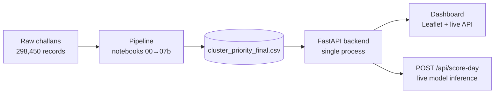
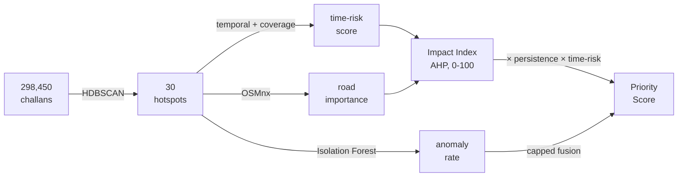

# Vahan Vigil
**AI-Powered Parking Enforcement Intelligence for Bengaluru**

Hackathon: GridLock — Flipkart × Bengaluru Traffic Police
Theme: Poor Visibility on Parking-Induced Congestion

---

## Problem

Parking enforcement in Bengaluru today is **patrol-based and reactive** —
officers go where they expect violations to be, not where data says they
actually are. There's no heatmap of violations vs. congestion impact, and
no consistent way to prioritize which zones need enforcement most.

## Solution

Vahan Vigil ("vahan" = vehicle, "vigil" = watchful oversight) turns six
months of Bengaluru challan data (298,450 records) into:

- **30 spatially detected hotspots** — HDBSCAN clustering on real GPS data
- **A 0–100 congestion impact score** per zone — AHP-weighted, sensitivity-tested
- **A single ranked priority list** — what to act on first, and why
- **A live scoring endpoint** — on-demand anomaly check via a trained Isolation Forest

It also surfaces a finding the raw data hid: most zones have a multi-hour
**daytime enforcement blind spot**. Violations cluster at night not because
illegal parking is a night-time problem, but because that's when patrol
activity happens to be concentrated. The tool corrects for this instead of
reproducing it.

## Key results

| Finding | Detail |
|---|---|
| Hotspots detected | 30, from 298,450 raw records |
| Top priority zone | Upparpet (cluster 28) — final priority score 100 |
| Naive ranking fails | Rajajinagar: #22 by raw count → **#2** by final priority |
| Enforcement blind spot | 77–93% of zones show a multi-hour daytime coverage gap |
| Weight validation | AHP consistency ratio 0.0044; sensitivity-tested to min. 0.97 rank correlation under ±20% weight perturbation |

## System architecture



One process serves both the API and the dashboard — `uvicorn main:app` and
open the URL, nothing else to run.

## Pipeline summary



| Stage | Does what |
|---|---|
| 00 | Feature engineering — filter, parse violations, severity & vehicle weighting |
| 01 | EDA — found night-time skew, Feb–Mar data gap, coordinate duplication |
| 02 | HDBSCAN — 298,450 points → 30 hotspots |
| 03 / 03b | Temporal profiling + enforcement blind-spot detection ⭐ |
| 04 | Isolation Forest — anomaly detection, model saved for reuse |
| 05 | OSMnx — real road classification per cluster |
| 06 | Congestion Impact Index — AHP-weighted, sensitivity-validated |
| 07 / 07b | Priority Ranking — multiplicative scoring, baseline comparison, anomaly fusion |

Full reasoning for each stage: see [`ARCHITECTURE.md`](ARCHITECTURE.md).

## Validation — what's proven vs. estimated

**Validated:** hotspot detection is deterministic and reproducible. AHP
weights are consistency-checked (0.0044) and robust to perturbation
(min. 0.97 rank correlation). The enforcement blind-spot finding holds
across all 30 clusters, not a one-off.

**Honest estimate, not measurement:** the Congestion Impact Index and
Priority Score are structured proxies — there's no traffic-flow sensor
data in this dataset. They're internally consistent but not yet checked
against observed real-world congestion. The *ranking* is more defensible
than the *exact number*. This is stated in the product itself (dashboard
landing page + `/api/summary`'s `data_note`), not just here.

## Demo / run locally

- **Live demo:** _\[add Render URL here\]_
- **Interactive API docs:** `/docs` on the running server — test
  `POST /api/score-day` directly in the browser

```bash
cd backend
pip install -r requirements.txt
uvicorn main:app --reload --port 8000
```
Open `http://localhost:8000`. Full setup notes (including the two
`.joblib` files needed for live inference): [`backend/RUN_INSTRUCTIONS.md`](backend/RUN_INSTRUCTIONS.md).

## Tech stack

Python · pandas · scikit-learn · `hdbscan` · OSMnx · FastAPI · Leaflet (no paid map API key) · no database (30 rows, monthly refresh — see architecture doc for why)

## Repository structure

```
vahan-vigil/
├── main.py       #FastAPI app
├── static/       # Dashboard, single process
├── notebooks/       # Full pipeline, 00 → 07b, in run order
├── cluste_priority_final.csv             # Pipeline outputs (raw dataset linked, not committed)
└── ARCHITECTURE.md             # Architecture deep-dive
```

Full file-by-file layout: [`ARCHITECTURE.md`](ARCHITECTURE.md).
